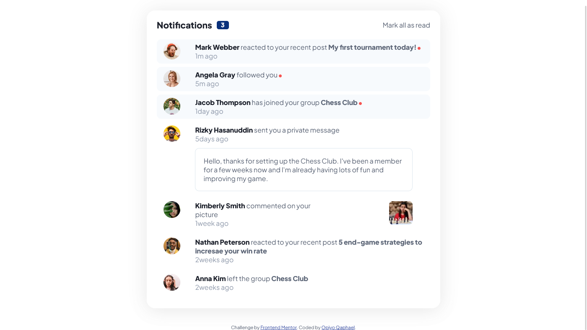

# Frontend Mentor - Notifications page solution

This is a solution to the [Notifications page challenge on Frontend Mentor](https://www.frontendmentor.io/challenges/notifications-page-DqK5QAmKbC). Frontend Mentor challenges help you improve your coding skills by building realistic projects. 

## Table of contents

-   [Overview](#overview)
  - [The challenge](#the-challenge)
  - [Screenshot](#screenshot)
  - [Links](#links)
  - [Built with](#built-with)
  - [What I learned](#what-i-learned)
  - [Useful resources](#useful-resources)
  - [Author](#author)


## Overview
This is the front end mentor challenge recreation of Notifications page solution I did following my other frontend mentor code challenges

### The challenge

Users should be able to:

- Distinguish between "unread" and "read" notifications
- Select "Mark all as read" to toggle the visual state of the unread notifications and set the number of unread messages to zero
- View the optimal layout for the interface depending on their device's screen size
- See hover and focus states for all interactive elements on the page

### Screenshot




### Links

- Solution URL: [https://github.com/Qaphael/notifications-page](https://github.com/Qaphael/notifications-page)
- Live Site URL: [https://qaphael.github.io/notifications-page/](https://qaphael.github.io/notifications-page/)

## My process

### Built with

- Semantic HTML5 markup
- CSS custom properties
- Flexbox
- CSS Grid
- vscode

### What I learned

I learned and practiced a great deal of flex property in this challenge for positioning

```html
<h1>Some HTML code I'm proud of</h1>

<div class="notification unread">
  <div class="profile-img-box">
    
  </div>
  <div class="content">
    <p class="the-line">
      <span class="name">Angela Gray </span>
      <span class="normal-text">followed you</span>
      <span class="red-dot"></span>
    </p>
    <p class="time-posted">5m ago</p>
  </div>
</div>

```
```css
.proud-of-this-css {
  color: papayawhip;
}

.notification {
  display: grid;
  grid-template-columns: 7% 93%;
  gap: 1rem;
  border-radius: 10px;
  margin-bottom: 0.5rem;
  padding: 0.5rem 1rem;
}

```

### Useful resources

- [unicon icons ](https://iconscout.com/unicons) - This helped me for icons.
- [google fonts](https://fonts.google.com/) - This helped me for fonts i used in this challenge.

## Author

- Website - [Qaphael Opiyo](https://qaphael-portfolio-website.web.app/)
- Frontend Mentor - [@Qaphael](https://www.frontendmentor.io/profile/Qaphael)
- Twitter - [@laflo__lr](https://twitter.com/Laflo_lr)
- Github - [@Qaphael](https://github.com/Qaphael)

